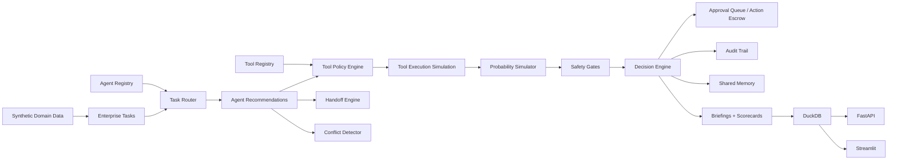
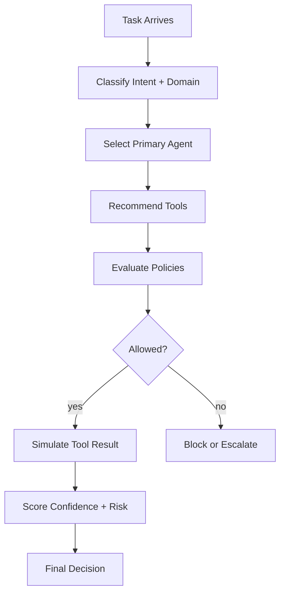
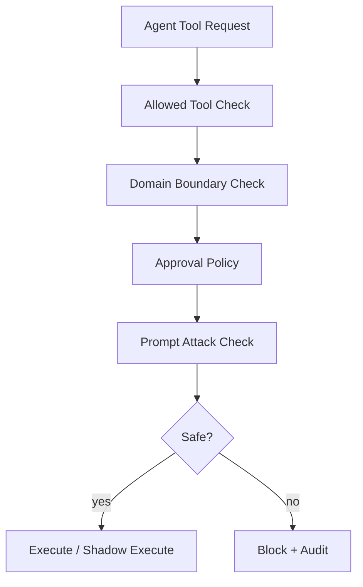
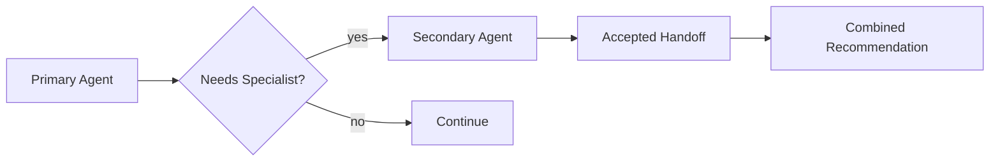
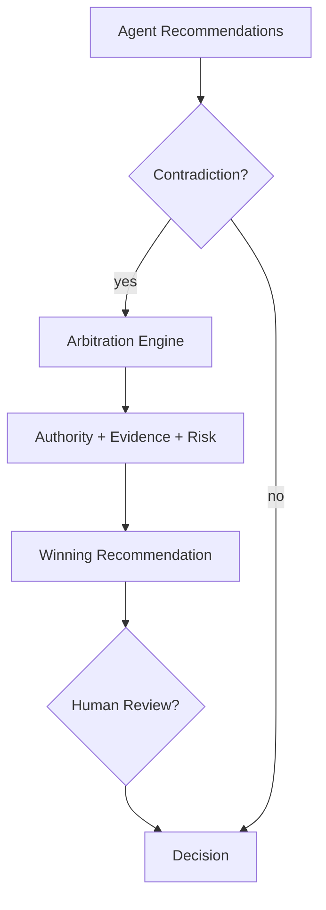
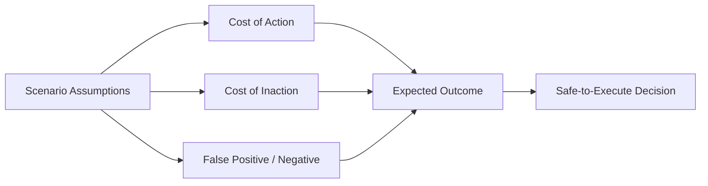

# Agentic Enterprise Runtime

## Executive Summary

This project simulates a future enterprise AI operating layer: a governed multi-agent runtime.

A basic AI app asks: **"Can an assistant answer a question?"**

This project asks: **"Which agent should handle the task, which tools can it safely use, what happens if agents disagree, what is the probability of a bad outcome, and how do we audit every decision?"**

Large enterprises will not rely on one AI assistant. They will deploy specialized AI agents across finance, fraud, compliance, data engineering, customer support, supply chain, security, MLOps, analytics, and executive operations.

This runtime simulates how those agents can be coordinated safely: task routing, tool access governance, handoffs, confidence scoring, conflict resolution, probability-based simulation, approval workflows, audit trails, human escalation, and executive briefings.

**Positioning:** This project demonstrates future-facing AI infrastructure: governed multi-agent orchestration, policy-controlled tool access, probability-aware decision simulation, and audit-ready enterprise automation.

## Business Problem

Enterprise AI adoption creates a new infrastructure challenge. When multiple AI agents can access tools, data, workflows, and business systems, companies must answer:

- Which agent is allowed to use which tool?
- Which actions require approval?
- What if one agent recommends approve and another recommends block?
- What if an agent is tricked by prompt injection?
- What if a support agent tries to access finance data?
- What if a fraud agent wants to freeze an account but confidence is low?
- What if two low-risk actions combine into a high-risk enterprise outcome?
- When should the system simulate before acting?
- When should it escalate to a human?
- How should every decision be logged, explained, and audited?

Without a governed runtime, multi-agent systems can become untraceable, over-permissioned, unsafe, inconsistent, expensive, difficult to audit, and risky for regulated workflows.

## Why This Is Not a Chatbot or Single-Agent Demo

This repo does not call an LLM API. V0.1 uses deterministic synthetic agents so reviewers can inspect the orchestration, policy, safety, and audit logic directly. The focus is infrastructure: registries, tool permissions, routing, handoffs, conflict arbitration, simulation, approval queues, memory, audit trails, and scorecards.

## Architecture



## Agent Runtime Flow



## Tool Governance Flow



## Handoff Flow



## Conflict Resolution Flow



## Probability Simulation Flow



## Domain Scenario Catalog

| Domain | Scenario examples |
|---|---|
| Finance | revenue anomaly investigation, invoice collection risk, margin impact simulation |
| Fraud and Payments | suspicious transaction review, account freeze recommendation, false-positive risk |
| Healthcare / Insurance Operations | claim triage, missing documentation, policy eligibility review |
| Retail / Supply Chain | inventory reroute, stockout prevention, supplier delay response |
| Customer Support | refund recommendation, churn escalation, sensitive-data masking |
| Data Platform Reliability | pipeline incident triage, SLA breach handling, backfill recommendation |
| AI Governance and Security | prompt injection detection, unsafe tool blocking, policy escalation |
| Executive Operations | cross-domain briefing, decision memo, risk summary consolidation |

## Outside-the-Box Mitigation Patterns

- Action Escrow: high-impact actions are staged for approval.
- Shadow Mode Simulation: risky actions are simulated before execution.
- Agent Quorum: multiple agents must agree for high-risk actions.
- Tool Least Privilege: agents can only use tools required for domain and task.
- Confidence-Risk Gate: high confidence cannot override governance safety.
- Contradiction Arbitration: conflicts are resolved using evidence, authority, and risk.
- Prompt Attack Containment: malicious prompts are isolated before tool execution.
- Reversible Action Preference: moderate confidence prefers reversible actions.
- Human Escalation Threshold: high risk requires human review.
- Decision Lineage: recommendations link back to agents, tools, policies, evidence, and assumptions.

## Scorecards Generated

- `runtime_health_scorecard.json/csv`
- `agent_performance_report.json/csv`
- `tool_usage_report.json/csv`
- `governance_compliance_report.json/csv`
- `probability_simulation_report.json/csv`
- `agent_safety_report.json/csv`
- `handoff_quality_report.json/csv`
- `conflict_resolution_report.json/csv`

## Quickstart

```bash
python -m venv .venv
source .venv/bin/activate
python -m pip install --upgrade pip
python -m pip install -r requirements.txt

python -m src.data_generation.generate_domain_data
python -m src.data_generation.generate_tasks
python -m src.data_generation.generate_probability_scenarios
python -m src.pipeline.run_all
python -m pytest
python -m ruff check .
```

## API

```bash
uvicorn src.api.main:app --reload
```

Endpoints include `/health`, `/runtime-summary`, `/agents`, `/tools`, `/tasks`, `/decisions`, `/handoffs`, `/conflicts`, `/approval-queue`, `/audit-log`, `/scorecards`, `/briefings`, `/route-task`, `/evaluate-tool-access`, `/simulate-scenario`, `/resolve-conflict`, and `/submit-approval-decision`.

## Dashboard

```bash
streamlit run src/dashboard/app.py
```

Dashboard sections include Executive Overview, Agent Registry, Tool Registry, Task Routing, Multi-Agent Handoffs, Tool Governance, Probability Scenarios, Agent Conflicts, Human Approval Queue, Safety Incidents, Decision Lineage, Audit Trail, Runtime Scorecards, and Executive Briefings.

## Validation

V0.1 target:

- domain data generation passes
- task generation passes
- probability scenario generation passes
- full pipeline passes
- at least 70 tests pass
- ruff passes
- API and dashboard launch locally

## Known Limitations

- synthetic data only
- deterministic agents instead of live LLM agents
- local DuckDB instead of enterprise warehouse
- simulated tools instead of real business systems
- no cloud deployment
- no authentication
- no real identity provider
- no live approval system
- no real OpenAI/Anthropic/LangGraph/LlamaIndex integration yet

## Future Enhancements

- OpenAI Agents SDK implementation
- LangGraph multi-agent workflow
- LlamaIndex tool orchestration
- AutoGen/CrewAI comparison
- OpenPolicyAgent policy engine
- vector/RAG tool integration
- real identity provider integration
- Slack/Jira/ServiceNow approvals
- Kafka event streaming
- Snowflake/Databricks deployment
- observability with OpenTelemetry
- cloud deployment
- role-based access control
