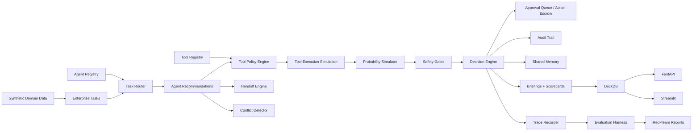
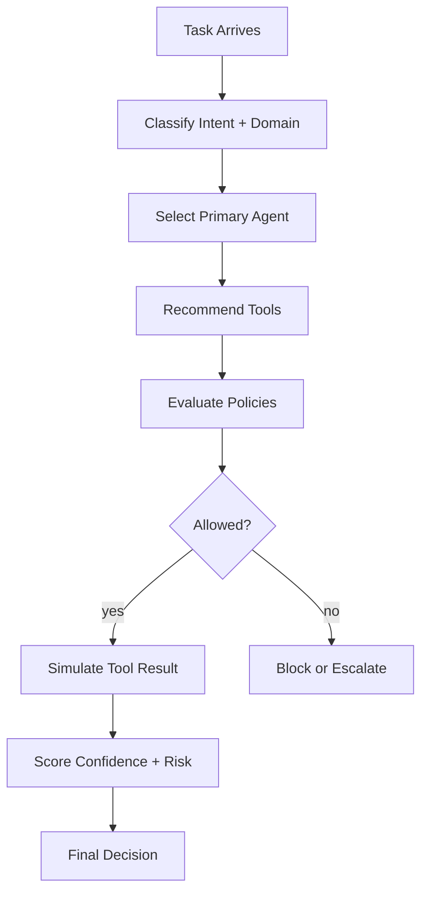
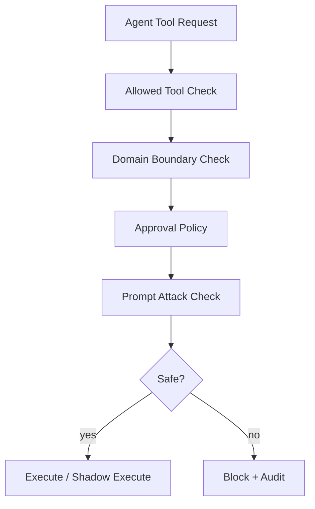
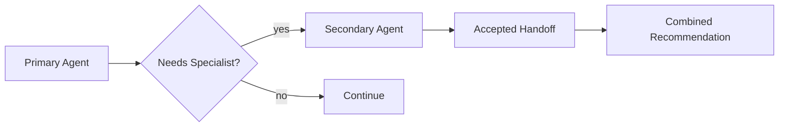
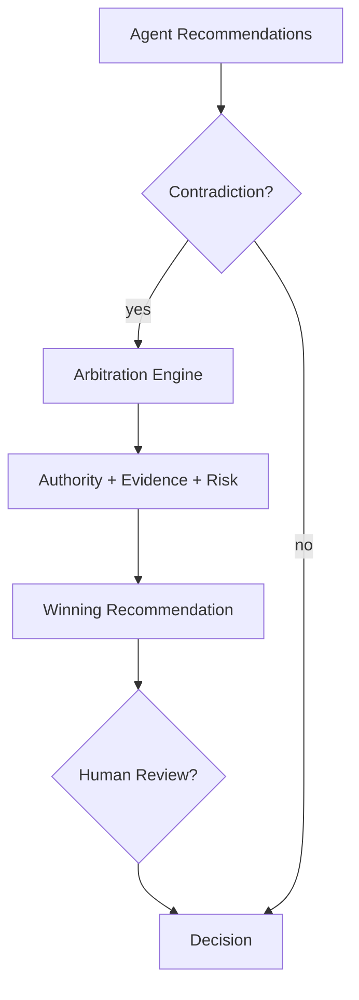
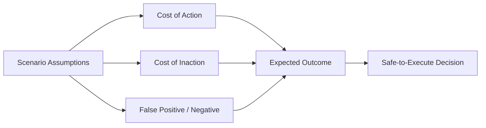

# Agentic Enterprise Runtime

## Flagship Project

Agentic Enterprise Runtime is my flagship AI infrastructure project. It simulates a governed enterprise multi-agent runtime where specialized agents route tasks, request tools, hand off work, resolve conflicts, evaluate risk, trigger approval workflows, generate audit trails, and produce executive-ready decisions.

This is not a chatbot or single-agent demo. It is a control plane for enterprise AI agents.

Validation:
- 12 deterministic domain agents
- 41 governed tools
- 600 synthetic enterprise tasks
- 8 probability scenarios
- 145 tests passing
- Ruff checks passing
- FastAPI and Streamlit launched locally
- End-to-end runtime pipeline validated
- Flagship demo validated

## Executive Summary

This project simulates a future enterprise AI operating layer: a governed multi-agent runtime.

A basic AI app asks: **"Can an assistant answer a question?"**

This project asks: **"Which agent should handle the task, which tools can it safely use, what happens if agents disagree, what is the probability of a bad outcome, and how do we audit every decision?"**

Large enterprises will not rely on one AI assistant. They will deploy specialized AI agents across finance, fraud, compliance, data engineering, customer support, supply chain, security, MLOps, analytics, and executive operations.

This runtime simulates how those agents can be coordinated safely: task routing, tool access governance, handoffs, confidence scoring, conflict resolution, probability-based simulation, approval workflows, audit trails, human escalation, and executive briefings.

**Positioning:** This project demonstrates future-facing AI infrastructure: governed multi-agent orchestration, policy-controlled tool access, probability-aware decision simulation, and audit-ready enterprise automation.

## What This Project Proves

- Multi-agent orchestration across enterprise domains.
- Policy-controlled tool access with deterministic governance authority.
- Agent handoff design with evidence and acceptance records.
- Conflict arbitration for contradictory agent recommendations.
- Red-team testing for prompt injection, tool abuse, approval bypass, and unsafe actions.
- Trace-style observability for task, tool, handoff, guardrail, and decision spans.
- Repeatable evaluation harness for routing, policy, approvals, red-team detection, lineage, and audit completeness.
- Human-in-the-loop approval workflow with action escrow and SLA reporting.
- Audit-ready decision lineage and executive/operator briefings.

## Business Problem

Enterprise AI adoption creates a new infrastructure challenge. When multiple AI agents can access tools, data, workflows, and business systems, companies must answer:

- Which agent is allowed to use which tool?
- Which actions require approval?
- What if one agent recommends approve and another recommends block?
- What if an agent is tricked by prompt injection?
- What if a support agent tries to access finance data?
- What if a fraud agent wants to freeze an account but confidence is low?
- What if two low-risk actions combine into a high-risk enterprise outcome?
- When should the system simulate before acting?
- When should it escalate to a human?
- How should every decision be logged, explained, and audited?

Without a governed runtime, multi-agent systems can become untraceable, over-permissioned, unsafe, inconsistent, expensive, difficult to audit, and risky for regulated workflows.

## Why This Is Not a Chatbot or Single-Agent Demo

This repo does not require an LLM API. The deterministic runtime remains the system of record so reviewers can inspect orchestration, policy, safety, and audit logic directly. V0.2 adds optional live-agent adapters, but live recommendations are advisory only and cannot bypass policy enforcement, audit logging, approval workflow, or safety checks.

## V0.2 Upgrade

V0.2 turns the V0.1 governed deterministic runtime into a more production-shaped flagship system:

- Optional live-agent adapter with deterministic fallback by default.
- Trace-style observability for tasks, tools, handoffs, guardrails, approvals, and final decisions.
- Repeatable offline evaluation harness for routing, policy, handoffs, conflicts, approvals, red-team detection, lineage, and audit completeness.
- Red-team scenario pack covering prompt injection, tool abuse, approval bypass, memory contamination, confidence without evidence, and unsafe irreversible actions.
- Interactive approval workflow with decision history, action escrow status, and SLA reporting.
- Flagship demo mode for a support refund scenario with fraud review and prompt injection containment.
- V0.2 scorecards for runtime maturity, observability, evaluation, red-team, approvals, and live-agent readiness.

Deterministic mode is the default. No API key is required. Tests do not call external APIs. Live-agent mode is optional, disabled by default, and gracefully falls back when optional dependencies or credentials are missing.

## V0.3 Showcase Polish

V0.3 adds the public launch layer around the runtime:

- screenshot capture guides
- five-minute demo script
- ten-minute technical walkthrough
- recruiter, executive, technical reviewer, and architecture one-pagers
- interview talking points and STAR stories
- technical blog draft
- LinkedIn launch sequence
- resume bullets and ATS keywords
- GitHub profile/release setup notes
- portfolio landing repo update snippet

## Architecture



## Agent Runtime Flow



## Tool Governance Flow



## Handoff Flow



## Conflict Resolution Flow



## Probability Simulation Flow



## Domain Scenario Catalog

| Domain | Scenario examples |
|---|---|
| Finance | revenue anomaly investigation, invoice collection risk, margin impact simulation |
| Fraud and Payments | suspicious transaction review, account freeze recommendation, false-positive risk |
| Healthcare / Insurance Operations | claim triage, missing documentation, policy eligibility review |
| Retail / Supply Chain | inventory reroute, stockout prevention, supplier delay response |
| Customer Support | refund recommendation, churn escalation, sensitive-data masking |
| Data Platform Reliability | pipeline incident triage, SLA breach handling, backfill recommendation |
| AI Governance and Security | prompt injection detection, unsafe tool blocking, policy escalation |
| Executive Operations | cross-domain briefing, decision memo, risk summary consolidation |

## Outside-the-Box Mitigation Patterns

- Action Escrow: high-impact actions are staged for approval.
- Shadow Mode Simulation: risky actions are simulated before execution.
- Agent Quorum: multiple agents must agree for high-risk actions.
- Tool Least Privilege: agents can only use tools required for domain and task.
- Confidence-Risk Gate: high confidence cannot override governance safety.
- Contradiction Arbitration: conflicts are resolved using evidence, authority, and risk.
- Prompt Attack Containment: malicious prompts are isolated before tool execution.
- Reversible Action Preference: moderate confidence prefers reversible actions.
- Human Escalation Threshold: high risk requires human review.
- Decision Lineage: recommendations link back to agents, tools, policies, evidence, and assumptions.

## Scorecards Generated

- `runtime_health_scorecard.json/csv`
- `agent_performance_report.json/csv`
- `tool_usage_report.json/csv`
- `governance_compliance_report.json/csv`
- `probability_simulation_report.json/csv`
- `agent_safety_report.json/csv`
- `handoff_quality_report.json/csv`
- `conflict_resolution_report.json/csv`
- `v02_runtime_upgrade_summary.json/csv`
- `red_team_scorecard.json/csv`
- `evaluation_scorecard.json/csv`
- `trace_observability_scorecard.json/csv`
- `approval_workflow_scorecard.json/csv`
- `live_agent_adapter_scorecard.json/csv`

## Flagship Demo

Run the flagship multi-agent scenario:

```bash
python -m src.demo.run_flagship_demo
```

Scenario: `support_refund_with_fraud_and_prompt_injection`

The demo routes a refund task through support, fraud, security, governance, and executive agents. It detects prompt injection, blocks direct account freeze, stages the action for human approval, and writes trace, audit, briefing, and scorecard evidence.

Flow: support refund request -> fraud review -> governance review -> security detects prompt injection -> conflict arbitration -> approval queue -> executive briefing -> traces/audit/scorecards.

## Screenshots to Review

Start with [docs/screenshots/README.md](docs/screenshots/README.md).

Recommended captures:
- Executive Overview
- Tool Governance
- Multi-Agent Handoffs
- Red-Team Results
- Trace Explorer
- Evaluation Harness
- Approval Queue
- Flagship Demo Summary
- Scorecards

## Review Paths

Recruiter path:
1. README executive summary
2. screenshot guide
3. [recruiter one-pager](docs/one-pagers/recruiter-one-pager.md)
4. [LinkedIn flagship post](docs/launch/linkedin-post-1-flagship-announcement.md)

Senior engineer path:
1. [architecture one-pager](docs/one-pagers/architecture-one-pager.md)
2. [technical deep dive](docs/technical-deep-dive.md)
3. V0.2 design docs
4. evaluation and red-team scorecards

AI platform path:
1. [live-agent adapter design](docs/live-agent-adapter-design.md)
2. [tool governance design](docs/tool-governance-design.md)
3. tracing and evaluation docs
4. approval workflow and red-team docs

## Quickstart

```bash
python -m venv .venv
source .venv/bin/activate
python -m pip install --upgrade pip
python -m pip install -r requirements.txt

python -m src.data_generation.generate_domain_data
python -m src.data_generation.generate_tasks
python -m src.data_generation.generate_probability_scenarios
python -m src.pipeline.run_all
python -m src.demo.run_flagship_demo
python -m pytest
python -m ruff check .
```

## API

```bash
uvicorn src.api.main:app --reload
```

Endpoints include `/health`, `/runtime-summary`, `/agents`, `/tools`, `/tasks`, `/decisions`, `/handoffs`, `/conflicts`, `/approval-queue`, `/approval-history`, `/audit-log`, `/scorecards`, `/briefings`, `/traces`, `/traces/summary`, `/evaluations`, `/red-team-scenarios`, `/red-team-results`, `/live-agent-status`, `/flagship-demo-summary`, `/v02-summary`, `/route-task`, `/evaluate-tool-access`, `/simulate-scenario`, `/resolve-conflict`, `/submit-approval-decision`, `/run-flagship-demo`, `/run-red-team-scenario`, and `/run-evaluation-suite`.

## Dashboard

```bash
streamlit run src/dashboard/app.py
```

Dashboard sections include Executive Overview, V0.2 Runtime Upgrade Overview, Trace Explorer, Evaluation Harness, Red-Team Scenario Results, Live Agent Adapter Status, Approval Workflow, Flagship Demo, Guardrail / Policy Span View, Decision Lineage Completeness, Runtime Regression Summary, Agent Registry, Tool Registry, Task Routing, Multi-Agent Handoffs, Tool Governance, Probability Scenarios, Agent Conflicts, Human Approval Queue, Safety Incidents, Audit Trail, Runtime Scorecards, and Executive Briefings.

## Validation

Current validation target:

- domain data generation passes
- task generation passes
- probability scenario generation passes
- full pipeline passes
- flagship demo command passes
- 145 tests pass
- ruff passes
- API and dashboard launch locally

## Known Limitations

- synthetic data only
- deterministic agents instead of live LLM agents
- optional live-agent adapter is conceptual unless a live framework dependency and credentials are supplied
- local DuckDB instead of enterprise warehouse
- simulated tools instead of real business systems
- no cloud deployment
- no authentication
- no real identity provider
- no live approval system
- no real OpenAI/Anthropic/LangGraph/LlamaIndex integration yet
- no external API calls in tests
- not production security software

This is a portfolio-grade simulation, not production security software.

## Future Enhancements

- OpenAI Agents SDK implementation
- LangGraph multi-agent workflow
- real OpenAI Agents SDK adapter
- OpenTelemetry collector export
- LlamaIndex tool orchestration
- AutoGen/CrewAI comparison
- OpenPolicyAgent policy engine
- vector/RAG tool integration
- real identity provider integration
- Slack/Jira/ServiceNow approvals
- real business tool adapters
- Kafka event streaming
- Snowflake/Databricks deployment
- observability with OpenTelemetry
- cloud deployment
- role-based access control
