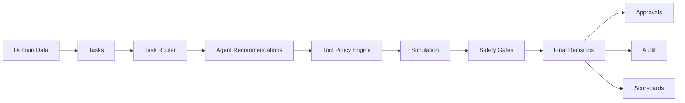

# Architecture

```mermaid
flowchart LR
    A["Domain Data"] --> B["Tasks"]
    B --> C["Task Router"]
    C --> D["Agent Recommendations"]
    D --> E["Tool Policy Engine"]
    E --> F["Simulation"]
    F --> G["Safety Gates"]
    G --> H["Final Decisions"]
    H --> I["Approvals"]
    H --> J["Audit"]
    H --> K["Scorecards"]
```

