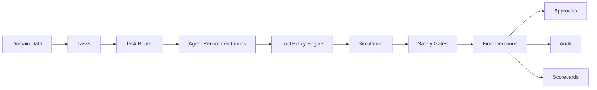
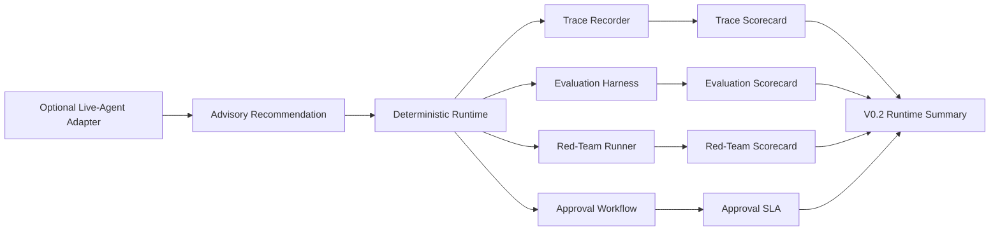

# Architecture

```mermaid
flowchart LR
    A["Domain Data"] --> B["Tasks"]
    B --> C["Task Router"]
    C --> D["Agent Recommendations"]
    D --> E["Tool Policy Engine"]
    E --> F["Simulation"]
    F --> G["Safety Gates"]
    G --> H["Final Decisions"]
    H --> I["Approvals"]
    H --> J["Audit"]
    H --> K["Scorecards"]
```

## V0.2 Extension

```mermaid
flowchart LR
    A["Deterministic Runtime"] --> B["Trace Recorder"]
    A --> C["Evaluation Harness"]
    A --> D["Red-Team Runner"]
    A --> E["Approval Workflow"]
    F["Optional Live-Agent Adapter"] --> G["Advisory Recommendation"]
    G --> A
    B --> H["Trace Scorecard"]
    C --> I["Evaluation Scorecard"]
    D --> J["Red-Team Scorecard"]
    E --> K["Approval SLA"]
    H --> L["V0.2 Runtime Summary"]
    I --> L
    J --> L
    K --> L
```

Live-agent mode cannot bypass deterministic governance.
