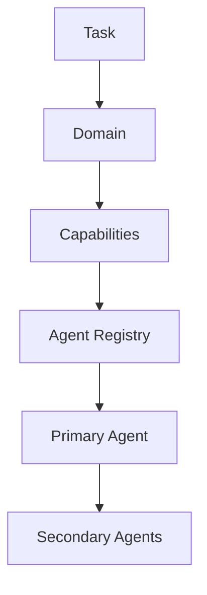

# Task Routing Flow

```mermaid
flowchart TD
    A["Task"] --> B["Domain"]
    B --> C["Capabilities"]
    C --> D["Agent Registry"]
    D --> E["Primary Agent"]
    E --> F["Secondary Agents"]
```

