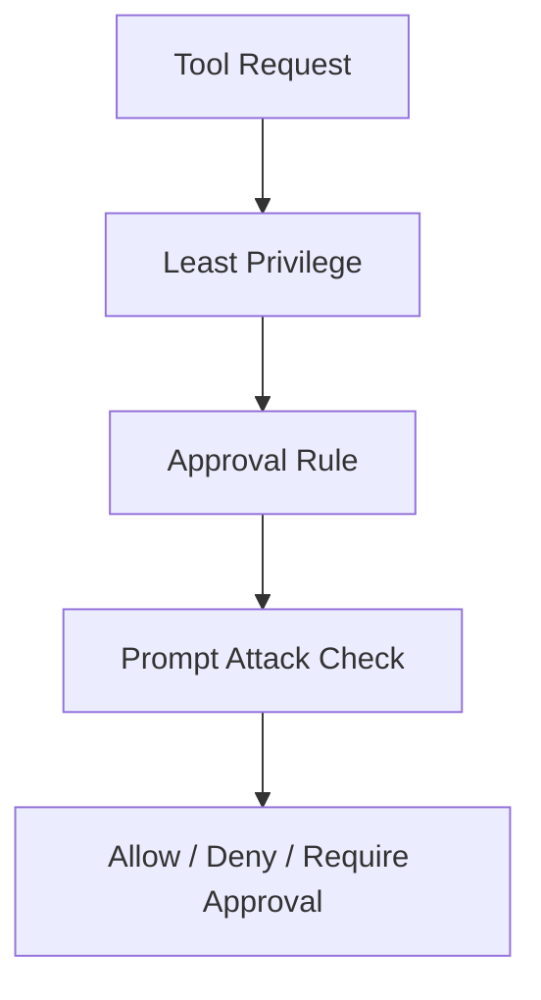

# Tool Governance Flow

```mermaid
flowchart TD
    A["Tool Request"] --> B["Least Privilege"]
    B --> C["Approval Rule"]
    C --> D["Prompt Attack Check"]
    D --> E["Allow / Deny / Require Approval"]
```

