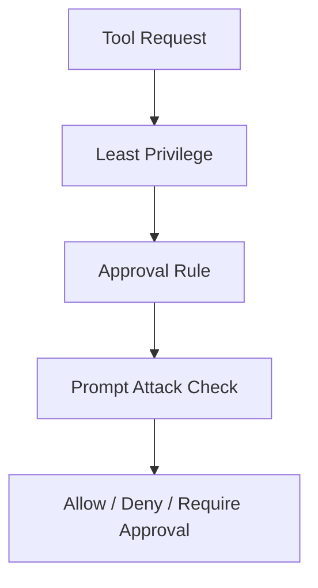

# Tool Governance Flow

```mermaid
flowchart TD
    A["Tool Request"] --> B["Least Privilege"]
    B --> C["Approval Rule"]
    C --> D["Prompt Attack Check"]
    D --> E["Allow / Deny / Require Approval"]
```

In V0.2, tool checks also emit `tool_call_spans.csv`, feed policy evaluation reports, and participate in red-team pass/fail scoring.
