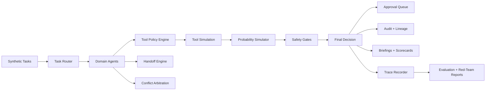

# Architecture One-Pager

## Problem

Enterprise AI agents need a runtime that controls tool access, handoffs, conflicts, approvals, traces, and audit evidence.

## Architecture

## Core Components

- 12 deterministic domain agents
- 41 governed tools
- 600 synthetic enterprise tasks
- 8 probability scenarios
- task router, policy engine, handoff engine, conflict arbitration, simulator, safety gates, approval queue, audit trail, and scorecards

## V0.2 Upgrade Components

- optional live-agent adapter
- trace-style observability
- offline evaluation harness
- red-team scenario pack
- approval decision history
- flagship demo mode

## Artifacts Generated

CSV, JSON, Markdown, DuckDB, FastAPI, Streamlit dashboard, scorecards, traces, red-team results, evaluation reports, and demo briefings.

## Validation Proof

- 145 tests passing
- ruff passing
- full pipeline validated
- flagship demo validated
- API and dashboard launched locally

